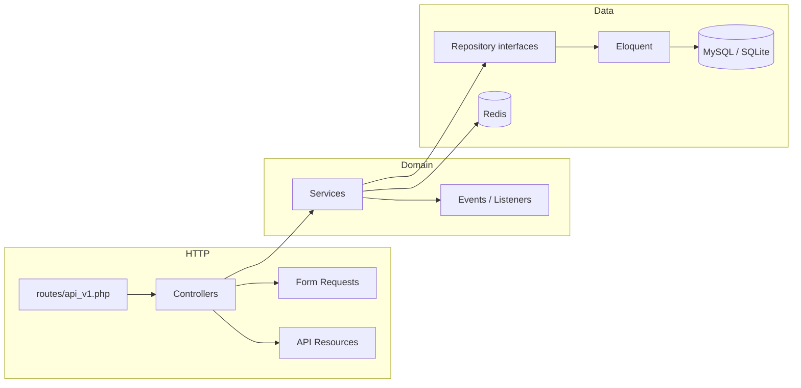
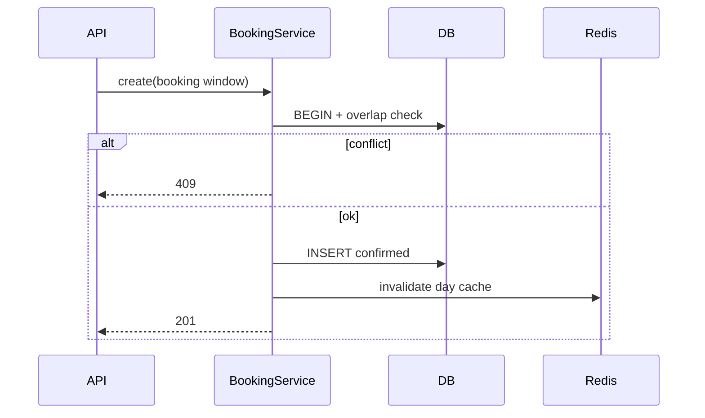

# Laravel Booking System API Showcase

**Production-style reservation backend** — overlap-safe scheduling, JWT auth, RBAC, Redis-cached availability, queued notifications, OpenAPI, PHPUnit, Docker, and GitHub Actions CI.

> **GitHub description:** Laravel booking system API with auth, booking workflows, availability checks, API versioning, Redis caching, Swagger docs, tests, Docker, and CI.
>
> **Topics:** `laravel` · `php` · `booking-system` · `rest-api` · `jwt` · `redis` · `swagger` · `docker` · `backend` · `api-versioning` · `portfolio`

[](https://github.com/sameh-bakleh/booking-system-api-showcase/actions/workflows/ci.yml)

| | |
|---|---|
| **What** | Versioned REST API (`/api/v1`) for bookable resources and time-window reservations |
| **Why** | Booking is a real domain problem: conflicts, state, auth, caching, and async side effects |
| **Proof** | Laravel 13 · PHP 8.3 · JWT · MySQL/Redis · 33 PHPUnit tests · CI green |
| **Run** | `docker compose up --build` → `http://localhost:8000/api/documentation` |

> Portfolio reference project for **PHP Backend**, **Laravel**, **Backend Engineer**, and **API Engineer** roles (Germany / EU). Synthetic seed data only — no real tenants.

---

## Recruiter summary

In 30 seconds: this repo shows **how I build a maintainable Laravel API**, not just CRUD endpoints.

- **Domain logic in services** — slot alignment, status transitions, ownership checks, and overlap detection run inside **DB transactions** (409 on conflict).
- **Clear HTTP layer** — Form Requests, API Resources, versioned routes, stable JSON errors.
- **Operational patterns** — Redis cache with invalidation on writes, database queues for mail, rate limiting, health check.
- **Reviewable quality** — OpenAPI/Swagger, feature + unit tests, Pint in CI, Docker build job.

Use it to evaluate API design, Laravel structure, and backend judgment — clone it, run tests, or open Swagger.

---

## Features

| Area | What is implemented |
|------|---------------------|
| **Auth** | Register, login, refresh, logout, `GET /auth/me` (JWT) |
| **RBAC** | `admin` vs `user`; middleware on `/admin/*` |
| **Resources** | List/detail bookable resources; admin create/update |
| **Bookings** | Create, list, reschedule, cancel with business rules |
| **Conflicts** | Overlap query for `pending` + `confirmed`; cancelled slots are free |
| **Availability** | Booked windows per day + suggested slot grid |
| **Caching** | Redis-backed availability reads; invalidated on booking changes |
| **Async** | Booking lifecycle events → queued mail notifications |
| **Docs** | OpenAPI 3 + Swagger UI at `/api/documentation` |

---

## Skills this project demonstrates

| Skill | Evidence in repo |
|-------|------------------|
| REST API design | Versioned routes, consistent JSON resources, `docs/API.md` |
| Laravel architecture | Controllers → Services → Repository interfaces |
| Validation | Dedicated Form Requests per endpoint group |
| Auth & authorization | JWT + `EnsureRole` middleware + service-level ownership |
| Data integrity | Transactions, overlap SQL, indexed booking windows |
| Caching strategy | `AvailabilityCacheService` + TTL + write invalidation |
| Error handling | `DomainException` hierarchy → predictable HTTP status codes |
| Testing | 33 PHPUnit tests (auth, booking, admin, availability, unit, health) |
| DevOps | Docker Compose, GitHub Actions (Pint, tests, OpenAPI, image build) |

---

## Architecture overview



**Request flow:** HTTP → validation → service (transaction + rules) → repository → JSON resource.

**Booking create flow:**



### Status model

| Status | Blocks overlap? | Notes |
|--------|-----------------|-------|
| `pending` | Yes | Active reservation |
| `confirmed` | Yes | Default on create |
| `cancelled` | No | Sets `cancelled_at`; slot reusable |

---

## Folder structure

```
app/
├── Http/
│   ├── Controllers/Api/V1/     # Thin API controllers (+ Admin/)
│   ├── Requests/               # Form Request validation
│   ├── Resources/              # JSON API shape
│   └── Middleware/             # RBAC (EnsureRole)
├── Services/                     # BookingService, AvailabilityService, AuthService
├── Repositories/                 # Interfaces + Eloquent implementations
├── Models/                       # User, BookableResource, Booking
├── Enums/                        # BookingStatus, UserRole
├── Exceptions/                   # Domain errors → JSON responses
├── Events/ + Listeners/          # Lifecycle notifications (queued mail)
└── OpenApi/                      # Swagger metadata

routes/api_v1.php                 # All v1 endpoints
database/migrations/              # Schema + indexes for overlap queries
tests/Feature/ + tests/Unit/      # API + domain tests
docs/API.md                       # Endpoint reference
docs/BOOKING_WORKFLOW.md          # Reservation lifecycle
docs/CONCURRENCY.md               # Overlap detection & transactions
docs/API_VERSIONING.md            # /api/v1 versioning strategy
docs/DOCKER.md                    # Container setup & troubleshooting
.github/workflows/ci.yml          # CI pipeline
docker-compose.yml                # App + MySQL + Redis
```

---

## Tech stack

| Layer | Technology |
|-------|------------|
| Language | PHP 8.3 |
| Framework | Laravel 13 |
| Auth | JWT (`tymon/jwt-auth`) |
| Database | MySQL 8 (Docker) · SQLite (local / tests) |
| Cache | Redis (`predis`) |
| Queue | Database driver |
| API docs | OpenAPI 3 · l5-swagger |
| Tests | PHPUnit 12 |
| Style | Laravel Pint |
| Containers | Docker · Docker Compose |
| CI | GitHub Actions |

---

## Screenshots

Add captures under `docs/screenshots/` after running locally:

| File | Shows |
|------|--------|
| `docs/screenshots/swagger-auth.png` | Swagger UI — auth endpoints |
| `docs/screenshots/swagger-bookings.png` | Swagger UI — booking endpoints |
| `docs/screenshots/booking-201.png` | Successful create (201 JSON) |
| `docs/screenshots/booking-409.png` | Overlap conflict response |
| `docs/screenshots/ci-green.png` | GitHub Actions passing |

---

## How to run

### Docker (fastest)

See **[docs/DOCKER.md](docs/DOCKER.md)** for troubleshooting, queues, and production image notes.

```bash
cp .env.example .env
docker compose up --build
```

| URL | Purpose |
|-----|---------|
| `http://localhost:8000/api/v1` | API base |
| `http://localhost:8000/api/documentation` | Swagger UI |
| `http://localhost:8000/up` | Health check |

Migrations and seeders run on startup.

### Native PHP

```bash
cp .env.example .env
php artisan key:generate
php artisan jwt:secret
touch database/database.sqlite
php artisan migrate --seed
php artisan serve
```

Optional: `php artisan queue:work` for mail jobs.

**Demo login** (seeded, local only):

| Role | Email | Password |
|------|--------|----------|
| Admin | `admin@example.com` | `password` |
| User | `user@example.com` | `password` |

---

## How to test

```bash
composer install
composer test                 # PHPUnit (33 tests)
vendor/bin/pint --test        # Code style (runs in CI)
php artisan l5-swagger:generate
```

**Test strategy**

| Suite | Covers |
|-------|--------|
| `AuthApiTest` | Register, login, refresh, logout, 401/422 |
| `BookingApiTest` | Create, overlap 409, cancel, reschedule, ownership, events |
| `AdminApiTest` | Admin routes + 403 for regular users |
| `AvailabilityApiTest` | Booked windows, validation |
| `AvailabilityServiceTest` | Slot grid logic (unit, mocked cache) |
| `HealthCheckTest` | `/up` liveness endpoint |

PHPUnit uses in-memory SQLite and isolated cache/queue drivers (`phpunit.xml`).

---

## CI/CD

Workflow: [`.github/workflows/ci.yml`](.github/workflows/ci.yml)

| Job | Steps |
|-----|--------|
| **Laravel** | `composer install` → Pint → PHPUnit → OpenAPI generate |
| **Docker** | Production image build smoke test |

Triggers on `push` / `pull_request` to `main` or `master`.

---

## API reference

| Document | Contents |
|----------|----------|
| [docs/API.md](docs/API.md) | Endpoint list, request/response shapes |
| [docs/BOOKING_WORKFLOW.md](docs/BOOKING_WORKFLOW.md) | Status lifecycle, authorization, code map |
| [docs/CONCURRENCY.md](docs/CONCURRENCY.md) | Overlap SQL, transactions, race-scope honesty |
| [docs/API_VERSIONING.md](docs/API_VERSIONING.md) | `/api/v1` routing and v2 migration pattern |

Interactive docs: **`/api/documentation`** (authorize with Bearer token from login).

---

## Security & privacy

- **No real user data** — all seeds use `@example.com` and documented demo passwords.
- **Never commit** `.env`, JWT secrets, or `auth.json`. Use `.env.example` only.
- **Local `.env`** is gitignored.
- Docker Compose uses local-only credentials; override `JWT_SECRET` outside local dev.
- Vulnerability reporting: [SECURITY.md](SECURITY.md)

---

## Recruiter note

This is a **backend API showcase**, not a mobile app or storefront. It is meant to complement client projects in a broader portfolio (e.g. iOS/Android apps consuming REST APIs).

**Good evaluation path:** clone → `composer test` → open Swagger → create a booking → trigger a 409 overlap → skim `BookingService.php`.

---

## Contributing

[CONTRIBUTING.md](CONTRIBUTING.md) · [LICENSE](LICENSE) (MIT)
