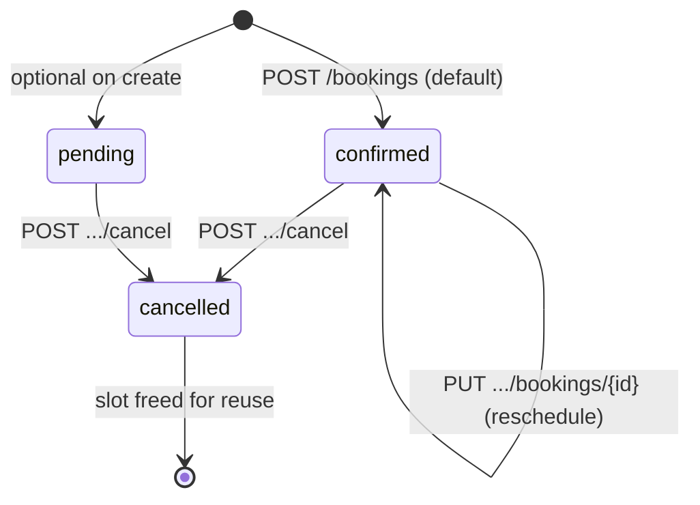

# Booking workflow

This document describes how reservations move through the API — from discovery to cancellation — and where business rules live in code.

## Domain objects

| Entity | Role |
|--------|------|
| **Bookable resource** | Something that can be reserved (room, desk, studio). Has `slot_duration_minutes`, `capacity`, `timezone`, and `is_active`. |
| **Booking** | A time window `[starts_at, ends_at)` on one resource for one user. |
| **User** | Authenticated actor with role `user` or `admin`. |

## Status lifecycle



| Status | Blocks overlap? | Notes |
|--------|-----------------|-------|
| `pending` | Yes | Treated as an active hold |
| `confirmed` | Yes | Default when creating via API |
| `cancelled` | No | Sets `cancelled_at`; same window can be booked again |

Cancelled bookings cannot be rescheduled. Attempting to update one returns **422**.

## Typical client flow

### 1. Authenticate

```http
POST /api/v1/auth/login
```

Receive `access_token`. Send `Authorization: Bearer <token>` on protected routes.

### 2. Browse resources

```http
GET /api/v1/resources
GET /api/v1/resources/{id}
```

### 3. Check availability

Two complementary endpoints:

| Endpoint | Purpose |
|----------|---------|
| `GET /resources/{id}/availability?date=Y-m-d` | Booked windows for a calendar day (Redis-cached) |
| `GET /resources/{id}/suggested-slots?date=Y-m-d` | Full slot grid with `available: true/false` |

Use suggested slots for UX pickers; use availability for calendar overlays.

### 4. Create booking

```http
POST /api/v1/bookings
```

**Service path:** `BookingController` → `StoreBookingRequest` → `BookingService::create()`

Rules enforced in `BookingService`:

1. Resource exists and `is_active`
2. `ends_at` is after `starts_at`
3. Duration is a positive multiple of `slot_duration_minutes`
4. No overlap with other `pending` or `confirmed` bookings on the same resource (inside a DB transaction)
5. On success: persist booking, invalidate availability cache, dispatch `BookingCreated` event

| HTTP | Meaning |
|------|---------|
| **201** | Booking created |
| **404** | Resource missing or inactive |
| **409** | Overlap conflict (`BookingConflictException`) |
| **422** | Validation or slot alignment (`DomainException`) |

### 5. Reschedule

```http
PUT /api/v1/bookings/{id}
```

Same overlap and slot rules as create. Owner or admin only. Cache invalidated for old and new date ranges. Dispatches `BookingUpdated`.

### 6. Cancel

```http
POST /api/v1/bookings/{id}/cancel
```

Sets `status = cancelled` and `cancelled_at`. Owner or admin. Idempotent if already cancelled. Dispatches `BookingCancelled`.

Admins may also use `POST /api/v1/admin/bookings/{id}/cancel`.

## Authorization

| Action | `user` | `admin` |
|--------|--------|---------|
| List own bookings | Yes (`GET /bookings`) | Yes (+ filter any user) |
| Create booking | Yes | Yes |
| Reschedule / cancel own | Yes | Yes |
| Reschedule / cancel others | No (**403**) | Yes |
| Admin booking index | No (**403**) | Yes |
| Manage resources | No | Yes |

Checks live in `BookingService::assertCanMutate()` and `EnsureRole` middleware for `/admin/*`.

## Side effects (async)

Booking lifecycle events trigger queued mail via `SendBookingLifecycleNotification`:

- `BookingCreated`
- `BookingUpdated`
- `BookingCancelled`

PHPUnit uses `QUEUE_CONNECTION=sync`; Docker uses the `database` queue driver — run `php artisan queue:work` if you want mail jobs processed outside tests.

## Code map

| Concern | Location |
|---------|----------|
| HTTP validation | `app/Http/Requests/Booking/*` |
| Business rules | `app/Services/BookingService.php` |
| Persistence | `app/Repositories/BookingRepository.php` |
| Overlap query | `BookingRepository::hasOverlappingActiveBooking()` |
| Cache | `app/Services/AvailabilityCacheService.php` |
| Slot grid | `app/Services/AvailabilityService.php` |
| JSON shape | `app/Http/Resources/BookingResource.php` |

## Related docs

- [API reference](API.md)
- [Concurrency & overlap handling](CONCURRENCY.md)
- [API versioning](API_VERSIONING.md)
